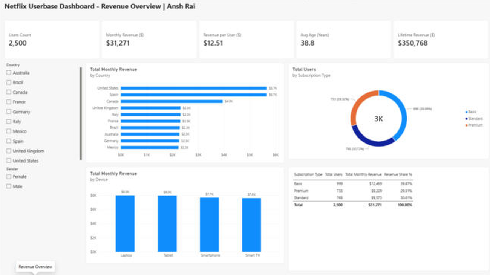
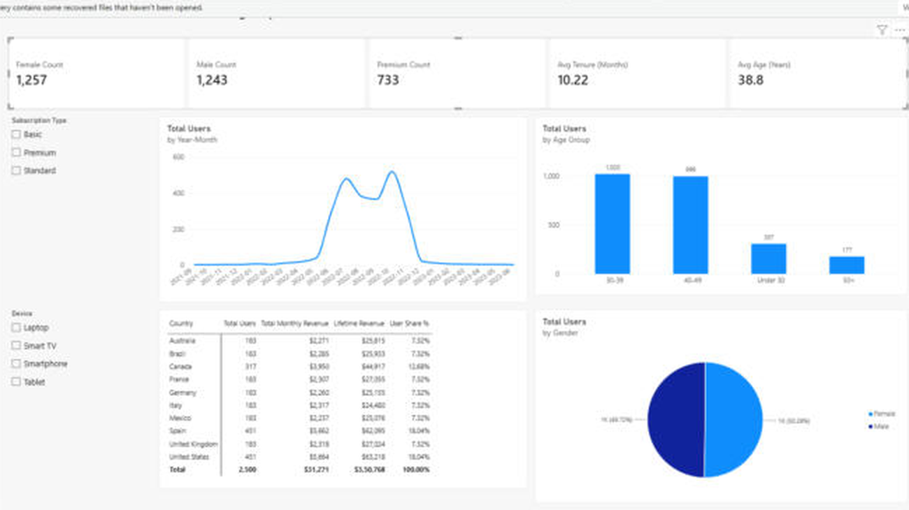

# 🎬 Netflix Userbase Dashboard in Power BI

 

A **2-page interactive Power BI dashboard** analysing 2,500 Netflix subscribers: revenue by country, plan and device, user demographics, tenure and sign-up trends. It is built on a **star-schema data model** with DAX measures.

| Page 1: Revenue Overview | Page 2: User Insights |
|---|---|
|  |  |

## 📊 Dataset
Netflix Userbase dataset (2,500 users, Sept 2021 – Jul 2023), split into a fact table and 4 lookup files: `Netflix Userbase.xlsx`, `Country.csv`, `Device.xlsx`, `Subscription.xlsx`, `gender.csv` → [`data/`](data/)

## 🧱 Data model (star schema)
```
                 Country (ID)
                     │ 1
                     │
 Subscription 1 ─── * Netflix Userbase (fact) * ─── 1 Gender
                     │ *            │ *
                     │ 1            │ 1
                  Device         Date (calendar table, marked as date table)
```
- **Power Query:** promoted headers, removed the duplicate `Device_ID` column, set data types, filtered blank rows
- **Calculated columns:** `Tenure Months` (DATEDIFF), `Age Group` (SWITCH)

## 🧮 DAX measures
| Type | Measures |
|---|---|
| Aggregations | `Total Users = COUNTROWS(...)`, `Total Monthly Revenue = SUM(...)`, `Average Age = AVERAGE(...)` |
| Iterators | `Lifetime Revenue = SUMX(..., [Monthly Revenue] * (DATEDIFF(Join, Last Payment, MONTH)+1))`, `Avg Tenure = AVERAGEX(...)` |
| Filter context | `Female Users`, `Male Users`, `Premium Users` (CALCULATE), `Revenue Share %`, `User Share %` (ALL) |
| Display | Text KPI measures with `FORMAT()` so cards show exact values |

Full code: [`dax/measures.dax`](dax/measures.dax) · whole model as TMDL: [`dax/model.tmdl`](dax/model.tmdl)

## 🏆 Key numbers
| Users | Monthly revenue | Revenue per user | Lifetime revenue | Avg age | Avg tenure |
|---|---|---|---|---|---|
| 2,500 | **$31,271** | $12.51 | **$350,768** | 38.8 | 10.2 months |

## 💡 Insights
- **Basic is the most popular plan** (999 users, 40%), ahead of Standard (768) and Premium (733). Upselling Basic users is the biggest revenue lever.
- **US ($5,664) and Spain ($5,662)** lead revenue with 451 users each, about 36% of total revenue between them.
- Revenue is **evenly split across devices** (Laptop, Tablet, Smartphone and Smart TV each ≈ 25%), so no platform should be deprioritised.
- **Gender split is balanced** (1,257 F / 1,243 M), and **ages 30–49 make up 81%** of users.
- **94% of users joined between Jun and Nov 2022**, with a peak in Oct 2022 (521 sign-ups). Acquisition was campaign-driven, so a retention plan is needed for this cohort.

## ▶️ How to open
1. Install [Power BI Desktop](https://powerbi.microsoft.com/desktop) (free)
2. Open `Netflix_Userbase_Dashboard.pbix`
3. To refresh: **Transform data → Data source settings**, and point the file paths to your local `data/` folder

---
👤 **Ansh Rai**, Data Analyst · [LinkedIn](https://www.linkedin.com/in/anshrai-adr) · [GitHub](https://github.com/ANSHRAI21) · [Portfolio](https://a-s-pyratech-solutions.space)
